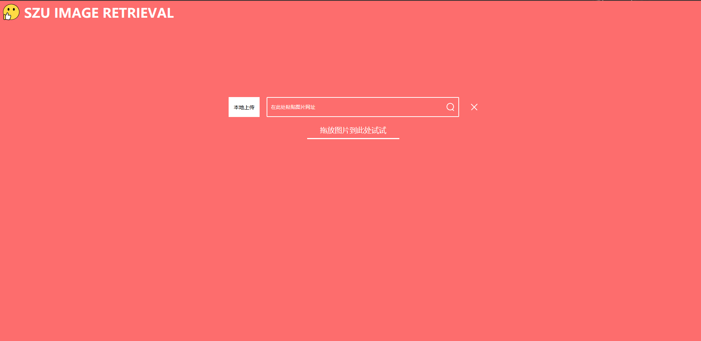

# CNN Image Retrieval SoTu

## 介绍

深圳大学计软的多媒体大作业。

主要基于这几个轮子整合一下：
[SoTu](https://github.com/willard-yuan/SoTu), [flask-keras-cnn-image-retrieval](https://github.com/willard-yuan/flask-keras-cnn-image-retrieval), [ImageRetrieval](https://github.com/wadasworths/ImageRetrieval)

直接用 VGG-16 提取特征，计算相似度，没做任何优化，适合作为自己的 Baseline，然后加上自己的改进。



## 用法

我自己这边的环境：

1. python >= 3.6
2. keras == 2.0.5
3. flask == 1.1.1

后面默认你已经装好了环境。

### 目录

```
.
├── app
│   ├── __init__.py
│   ├── main
│   ├── static
│   └── templates
├── config.py
├── images                                             # 数据集，推荐以软连接的形式放到这里
│   ├── holiday -> /path/to/holiday
│   └── ukbench -> /path/to/ukbench
├── model                                              # 生成的 h5 模型
│   ├── holiday_feature.h5
│   └── uk_feature.h5
├── README.md
├── sotu.py
├── utils.py
└── vision                                             # 模型定义
    ├── __init__.py
    ├── vgg16.py
    └── vgg_based.py                                   # 推断时候调用的模型，
```

### 提取特征

```
$ python index.py -database <path-to-dataset> -index <name-for-output-index>
```
生成的是 h5 格式的文件，把它放到 model 中。

### 配置

```sh
# 设置环境变量FLASK_APP和FLASK_ENV的值
$ export FLASK_APP=sotu.py
$ export FLASK_ENV=development
```

### 运行

```sh
$ flask run -h 0.0.0.0 -p 8080
```


## 模型

```
链接: https://pan.baidu.com/s/1tzCuoOj9_KNmRcYNNpbb9A 
提取码: 4nub
```

## 引用

1. [SoTu](https://github.com/willard-yuan/SoTu)
2. [flask-keras-cnn-image-retrieval](https://github.com/willard-yuan/flask-keras-cnn-image-retrieval)
3. [ImageRetrieval](https://github.com/wadasworths/ImageRetrieval)
